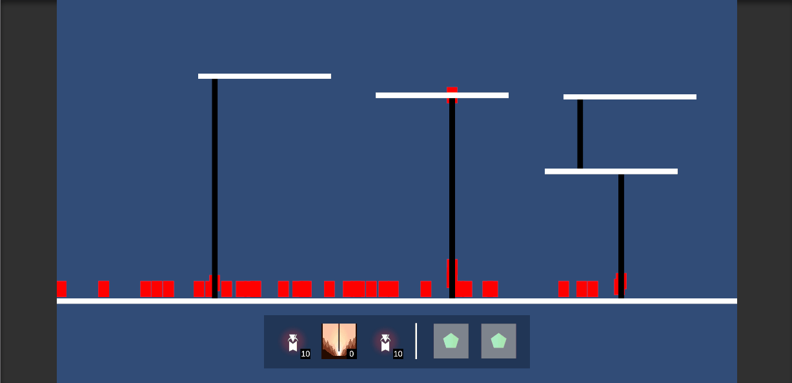
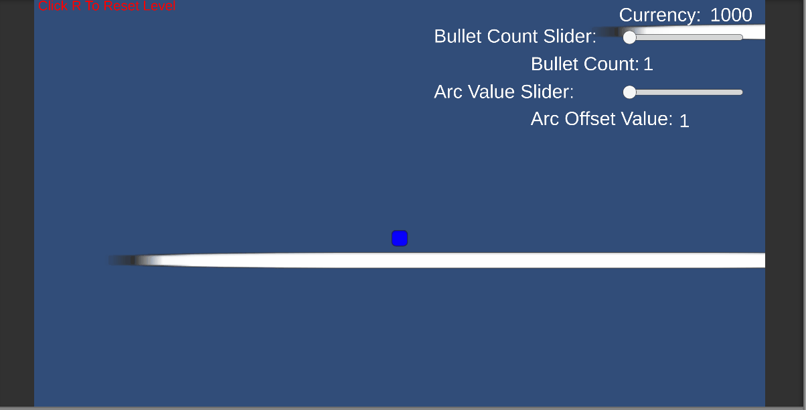

## Angelo Halabi Project Portfolio

This is a collection of my projects

### Project Raina

### Demon V Heroes

This is a prototype of a game where you play as a demon lord against the heroes.  

Key Features:
- Procedural Generation for the levels
- Dijkstra Pathfinding for the enemies 
- Source: https://github.com/MoonBlastStudios/SideScrollTD

### Broken2D

This is a prototype of a game where you play as a character where his life and energy is tied to his currency any movement or action will consume ammo.  

Key Features:
- JSON File Reading and Writting
- Screenshake and knockback
- Dynamic Upgrade Weapon System
- Source: https://github.com/MoonBlastStudios/Broken

